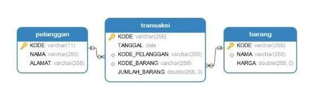
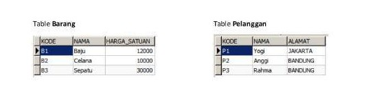
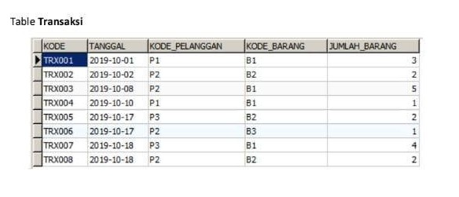
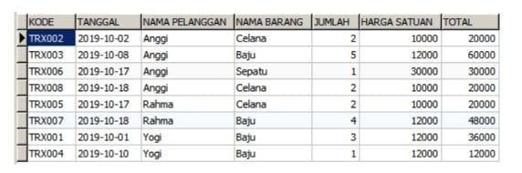
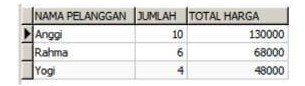

# INFORMASI REPOSITORY
Repository ini di buat untuk keperluan test SKK-MIGAS sebagai posisi programmer

### | Pertanyaan 1
Buatlah algoritma untuk menampilkan angka 1 s/d n, dengan ketentuan kelipatan 3 diganti "OK", kelipatan 4 diganti "YES", kelipatan 3 & 4 diganti "OKYES"

Contoh Output di bawah adalah ketikan nilai n "n" = 15

```
1 2 OK YES 5 OK 7 YES OK 10 11 OKYES 13 14 OK
```

### | Pertanyaan 2
Buatlah algoritma untuk empat soal di bawah ini, sesuai dengan nilai "n"

contoh output di bawah adalah ketika nilai "n" = 5

```
a.         
1
22
333
4444
55555

b.
1
21
321
4321
54321

c. 
1
23
454
3212
34543

d. 
1 10 11 20 21
2 9  12 19 22
3 8  13 18 23
4 7  14 17 24
5 6  15 16 25

```

### | Pertanyaan 3
Perhatikan array berikut ini 

n = [12, 9, 13, 6, 10, 4, 7, 2]

Buatlah algoritma untuk membuang semua nilai dengan kelipatan tiga dan mengurutkan sisanya ke dalam array baru secara ascending (dari kecil ke besar)

output yang diharapkan:

n = [2, 4, 7, 10, 13]

### | Pertanyaan 4
Perhatikan relasi table sebagai berikut:

 


Dengan contoh table sebagai berikut:

  

 

Sesuai gambar relasi dan data table di atas, buatlah empat Query SQL untuk menampilkan data sesuai ketentua:

a. Data Barang dengan harga lebih besar dari 10.000 diurutkan berdasarkan Harga Satuan (ascending)

b. Data Pelanggan yang namanya mengandung huruf "g" dengan alamat "BANDUNG"

c. Data seluruh transaksi sesuai dengan tampilan di bawah ini:



d. Data Rekap nama, jumlah dan total harga pembelian sesuai dengan tampilan di bawah ini:

